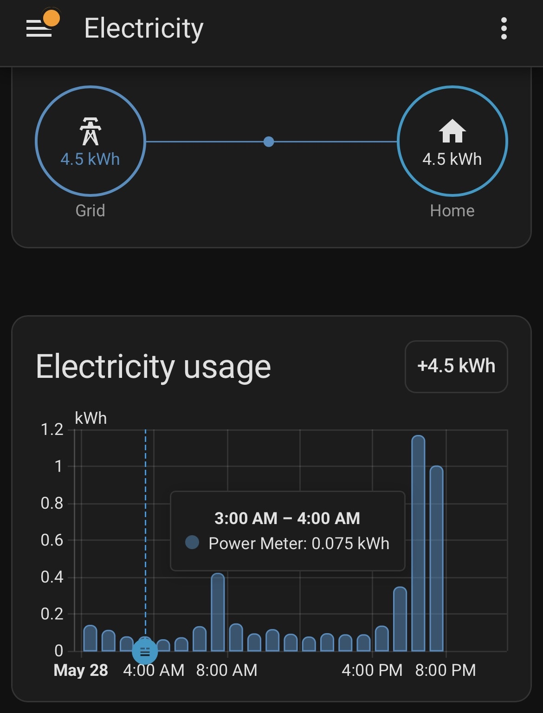

# RTLAMR — Itron ERT Smart Meter Reader

Read 900 MHz Itron ERT smart meters using an RTL-SDR dongle, then push consumption data into Home Assistant (Energy Dashboard), MQTT, or a local SQLite database.



## Quick Install

This is a [Hermes Agent](https://hermes-agent.nousresearch.com) skill. To install:

```bash
mkdir -p ~/.hermes/skills/hardware
git clone https://github.com/chazcheadle/rtlamr-meter-reader ~/.hermes/skills/hardware/rtlamr-meter-reader
```

Then reload skills (`/reload` in chat, or restart the gateway) and it becomes available as `/rtlamr-meter-reader`.

**Not using Hermes?** The [SKILL.md](./SKILL.md) is a standalone guide — follow it start to finish for a manual setup. The scripts in [`scripts/`](./scripts/) work independently of Hermes.

## Contents

| File | Purpose |
|------|---------|
| [`SKILL.md`](./SKILL.md) | Condensed setup guide — 14 steps, configuration reference, pitfalls |
| [`scripts/rtlamr-ha-bridge.sh`](./scripts/rtlamr-ha-bridge.sh) | Production bridge: reads meter, pushes to HA REST API |
| [`scripts/rtlamr-mqtt-bridge.py`](./scripts/rtlamr-mqtt-bridge.py) | MQTT bridge: publishes to HA auto-discovery topics |
| [`references/bridge-validation.md`](./references/bridge-validation.md) | Meter ID filtering, spike detection, validation rules |
| [`references/calibration-crosscheck.md`](./references/calibration-crosscheck.md) | Cross-referencing RTLAMR readings against known loads |
| [`references/rest-api-sensor-lifecycle.md`](./references/rest-api-sensor-lifecycle.md) | REST sensor lifecycle, `last_reset` requirements |
| [`references/architecture-variants.md`](./references/architecture-variants.md) | Proxmox multi-host setup |
| [`references/mqtt-setup.md`](./references/mqtt-setup.md) | MQTT broker and auto-discovery configuration |
| [`references/sqlite-backend.md`](./references/sqlite-backend.md) | SQLite schema and queries |
| [`references/systemd-setup.md`](./references/systemd-setup.md) | Systemd timer service and timer units |
| [`enclosure/`](./enclosure/) | Printable 3D model files for the RTL-SDR case |
| [`LICENSE`](./LICENSE) | MIT |

## Requirements

- Linux machine with USB port (or Proxmox host with RTL-SDR)
- RTL2838 DVB-T dongle (0bda:2838)
- Home Assistant instance (or Mosquitto broker, or just a text file — pick your delivery)
- 900 MHz Itron ERT meter in range

## Pipeline

```
RTL-SDR dongle → rtl_tcp → rtlamr → bridge script → Home Assistant / MQTT / SQLite
```

## Maintenance

Run `scripts/check-deps.py` to check for newer upstream versions of `rtlamr`, `paho-mqtt`, and `rtl-sdr`. Advisory only — no auto-upgrades.

```bash
./scripts/check-deps.py
```

## License

MIT
